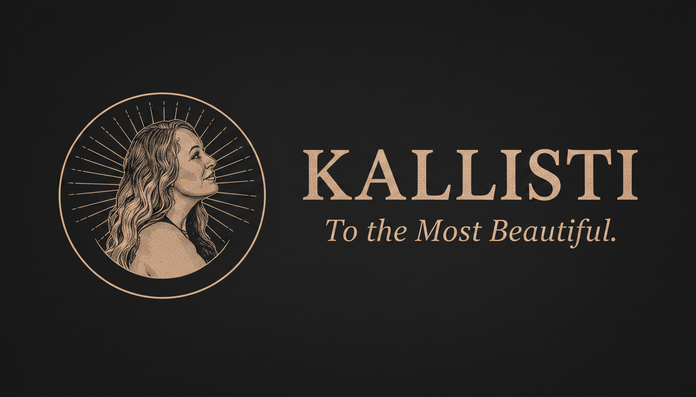
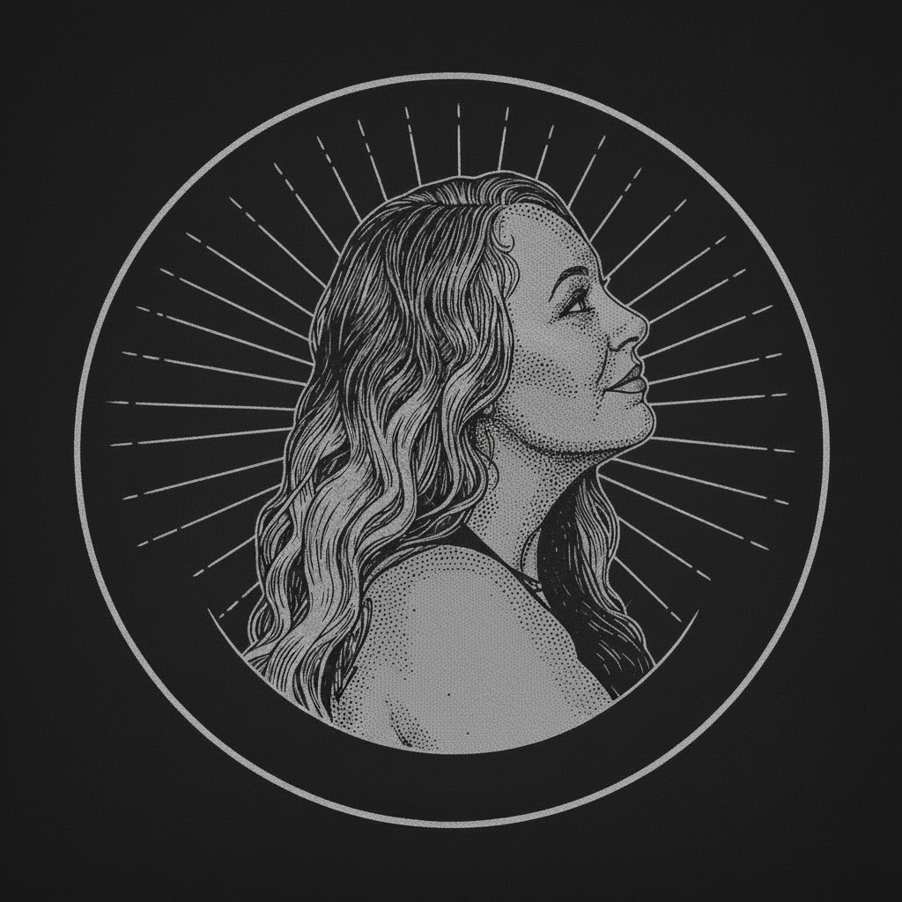

# Kallisti

**To the Most Beautiful.**

<p align="center">
  
</p>

<p align="center">
  
  
  
  
  
</p>

Native iOS companion for your self-hosted Hermes agent. Every thought, every tool, every answer — streamed live from your server to your hand.

## What is Kallisti?

Kallisti is a self-hosted iOS app that connects to your [Hermes Agent](https://github.com/nousresearch/hermes-agent) instance. It gives you full access to your AI agent from your phone — chat, voice, device sensors, context dashboards, and more.

No cloud. No subscription. No data harvesting. Just you and your AI.

## Features

- **Rich Chat** — Stream tool calls, reasoning, and responses in real time
- **Voice Interface** — Talk naturally with on-host STT/TTS (faster-whisper + edge-tts, zero keys)
- **Device Status** — Health, location, and motion data from your phone
- **Context Dashboard** — Memory, sessions, and active tasks at a glance
- **Ink Mode** — Handwriting and sketching with Apple Pencil support
- **Gateway Control** — Native gateway management from your phone
- **iPhone Landscape** — Three-panel layout (sidebar + content + inspector) when rotated

## Quick Start

### 1. Set Up the Connector

Install the connector on your server alongside your Hermes agent. See [connector/README.md](connector/README.md) for details.

```bash
cd connector
pip install -e .
kallisti setup
```

### 2. Install Kallisti

- **TestFlight**: [Join Beta](https://testflight.apple.com/...) (link coming soon)
- **Build from Source**: Clone this repo and open `Kallisti.xcodeproj` in Xcode

```bash
git clone https://github.com/fireishott/Kallisti.git
cd Kallisti
xcodegen generate
open Kallisti.xcodeproj
```

### 3. Pair

```bash
kallisti pair-phone
```

Scan the QR code from your terminal. Your agent is live.

## Architecture

```
┌─────────────┐     HTTP/WS      ┌──────────────┐
│   Kallisti   │ ◄──────────────► │  Connector   │
│   (iOS App)  │                  │  (Python)    │
└─────────────┘                  └──────┬───────┘
                                        │
                                 ┌──────▼───────┐
                                 │ Hermes Agent │
                                 │  (Server)    │
                                 └──────────────┘
```

## Requirements

- iOS 18.0+
- A running [Hermes Agent](https://github.com/nousresearch/hermes-agent) instance
- The Kallisti connector on your server

## Tech Stack

- **UI**: SwiftUI (Swift 6.2)
- **Networking**: URLSession + WebSocket
- **Connector**: Python 3.11+ (Hermes integration)
- **Speech**: faster-whisper (STT) + edge-tts (TTS), zero API keys

## Brand

<p align="center">
  
</p>

| Color | Hex | Role |
|-------|-----|------|
| Obsidian | #0C0C10 | Background |
| Platinum | #C8CCD2 | Primary text |
| Steel Silver | #8A909A | Secondary text |
| Pewter | #6B7078 | Muted elements |
| Dark Slate | #16181C | Card surfaces |
| Gold | #D4A853 | Accent |

- **Tagline:** "To the Most Beautiful."
- **Brand guide:** [docs/BRAND_SYSTEM.md](docs/BRAND_SYSTEM.md)

## Attribution

Kallisti is built on the foundation of [Herald](https://github.com/fireishott/Herald), which was forked from [Hermes-iOS](https://github.com/dylan-buck/Hermes-iOS) by [Dylan Buck](https://github.com/dylan-buck). Original work licensed under MIT.

## License

MIT License. See [LICENSE](LICENSE) for details.
