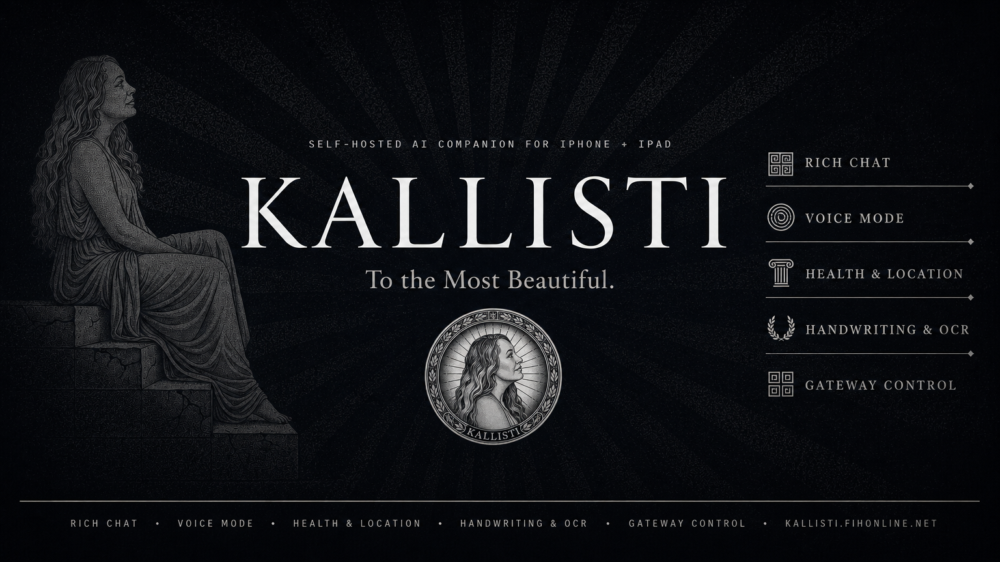

# Kallisti

<p align="center">
  
</p>

<p align="center">
  
  
  
  
</p>

Kallisti is a self-hosted iPhone and iPad client for [Hermes Agent](https://github.com/NousResearch/hermes-agent). It connects to a Hermes gateway over a native WebSocket for chat, sessions, models, and profiles, and uses the optional Kallisti connector for mobile services: push notifications, Live Activities, authenticated media, and optional sensor synchronization.

There is no hosted vendor backend. You bring your own Hermes gateway, connector, and TLS endpoint. Conversations, credentials, and media stay on infrastructure you control. The source is open under MIT and free to build yourself.

## Status

Kallisti is in **private beta**. TestFlight invites are being distributed to our beta testers now - if you are interested in joining, reach out through the [Discussions](https://github.com/fireishott/Kallisti/discussions) tab.

The app is usable for daily driving. Chat, the embedded TUI terminal, and handwriting notes are working; **Talk** (voice mode) and **watchOS** are coming soon and in active development. Some rough edges remain, and the app is under active iteration.

## Highlights

- Native WebSocket chat with durable session and outbox recovery
- Streaming Markdown, code blocks, tool activity, and reasoning status
- **Embedded TUI terminal mode** - run a real Hermes TUI inside the app over a PTY bridge, with touch scroll, session resume, and live tool timers
- One-time pairing-code sign-in with native gateway mode
- Authenticated inline rendering for agent-generated images
- Push notifications with per-device routing and an in-app inbox
- Live Activities on the lockscreen with elapsed-time heartbeat
- Widgets and notification-service extensions
- Handwriting notes with Apple Pencil, OCR / AI enrichment, and sync-as-session (iPad)
- Optional HealthKit, CoreLocation, and CoreMotion synchronization with an in-app background sync toggle
- Gateway status, logs, restart, software update checks, and truthful connection stages
- Connection latency monitoring and searchable auxiliary model switching

## Features

### Chat

- Streaming Markdown chat with syntax-highlighted code blocks
- Real-time tool activity and reasoning status
- Session history, model selection, and profile selection
- Durable outbox with deadline-aware recovery
- Draft text persists across reconnect and view recreation
- One live thinking placeholder per active turn
- Opens to your last active conversation, or a fresh session on first launch

### TUI terminal

- Real terminal emulator (SwiftTerm) connected to the connector's `/v1/terminal` PTY bridge
- Touch scroll mode and long-press text selection
- Resumable sessions: pick up the same TUI session after closing or backgrounding, or start fresh
- Live reasoning headers, tool lines with elapsed timers, and sticky status bar (model, context window, session clock)
- Terminal restarts cleanly when you return to the chat tab

### Notes (iPad)

- Handwriting with Apple Pencil on ruled paper
- OCR and AI enrichment through Hermes when you sync
- Each note syncs as its own session; every edit appends to that session
- Manual sync button with a live progress bar, or timed sync from 2 minutes to 24 hours
- Live reasoning bubble during sync so you know what the agent is actually doing

### Media

- Agent responses with local `MEDIA:` paths render inline as authenticated images
- Native image uploads stage through the gateway before prompt submission
- Historical images stay accessible after gateway restarts
- Media serving is restricted to configured Hermes media roots
- Aspect-fit thumbnails for consistent chat layout

### Mobile

- Push notifications for background turns, scoped per device via installation ID
- Live Activities on the lockscreen with elapsed-time heartbeat
- In-app notification inbox with dismiss and snooze actions
- Widgets and notification-service extensions
- **Talk (voice mode)** coming soon - push-to-talk with configurable ASR/TTS and Apple speech fallback
- Optional HealthKit, CoreLocation, and CoreMotion sync, with HealthKit background delivery toggled in-app
- Handwriting notes with Apple Pencil, OCR, and AI enrichment (iPad only)

### Gateway control

- Connection status with real, truthful stages
- Manual reset connection
- Gateway logs, restart, and software update checks
- Realtime connector latency readout in Settings
- Config editor with YAML validation, Save & Restart, and line-numbered editing

## In development

- **Talk (voice mode)** - push-to-talk with configurable ASR/TTS providers and Apple speech fallback. Barge-in, audio session management, and live transcript display. Not functional yet - known work in progress.
- **watchOS app** - native companion watch experience, coming soon
- **CarPlay** - glanceable trip context and hands-free control
- Expanding the notes pipeline and refining the TUI terminal
- Performance passes on long-session history and large media

## Architecture

```text
Kallisti iOS
  -> Hermes gateway WebSocket (chat, sessions, models, profiles)
  -> Kallisti connector (push, sensors, authenticated media, terminal bridge)
  -> optional public reverse proxy for remote access
```

The gateway WebSocket carries chat and session traffic. The connector adds mobile services: APNs push registration, Live Activities, sensor synchronization, authenticated media delivery, and the TUI terminal PTY bridge. For remote access, operators place a TLS reverse proxy (for example Caddy) in front of the gateway and connector.

Connection modes are documented in [docs/CONNECTION_MODES.md](docs/CONNECTION_MODES.md), production architecture in [docs/PRODUCTION_ARCHITECTURE.md](docs/PRODUCTION_ARCHITECTURE.md), and the threat model in [docs/THREAT_MODEL.md](docs/THREAT_MODEL.md).

## Requirements

- iOS 18 or newer
- A running [Hermes Agent](https://github.com/NousResearch/hermes-agent) gateway
- Python 3.11 or newer for the optional connector
- Xcode 16 or newer and an Apple Developer account only if you build from source

## Quick start

### TestFlight beta

Kallisti is in private beta. Once you have a TestFlight invite, install Kallisti, pair it with your Hermes gateway, and you are set. No Apple Developer account or Xcode setup is needed for the beta path.

If you want push notifications, HealthKit synchronization, Live Activities, authenticated media delivery, or the TUI terminal, run the optional connector on your Hermes host:

```bash
cd connector
python3 -m venv .venv
. .venv/bin/activate
pip install -e .
kallisti run
```

Configure secrets and environment-specific URLs outside the repository. Do not commit credentials, private keys, device identifiers, internal hostnames, or production logs. The connector serves the HTTP facade for push registration, Live Activities, and authenticated media on the port you configure.

### Build from source

Kallisti is open source under MIT and free to build. For tinkerers who want their own signed builds:

```bash
git clone https://github.com/fireishott/Kallisti.git
cd Kallisti
open Herald.xcodeproj
```

Select the `Kallisti` scheme, choose your Apple Developer team, configure your gateway URL, and build to a simulator or registered device. Detailed build notes are in [docs/BUILDING.md](docs/BUILDING.md) and configuration options in [docs/CONFIGURATION.md](docs/CONFIGURATION.md).

### Sign in on device

1. Launch Kallisti and choose the native gateway mode.
2. Generate a one-time pairing code from your Hermes host.
3. Enter the code in the app. The code is never persisted on the device.

## Push notifications

Push delivery uses APNs through the connector. The app registers an APNs token keyed by its installation ID, so multi-device setups route notifications to the right device. Live Activity registration uses a separate token kind.

See [docs/PUSH_RELAY.md](docs/PUSH_RELAY.md) for the relay and push broker architecture, and [docs/IOS_CAPABILITIES.md](docs/IOS_CAPABILITIES.md) for capability setup (background modes, push entitlements, Live Activities).

## Native media delivery

Agent responses can include local `MEDIA:` paths. In native mode, Kallisti converts supported paths to the authenticated `/v1/native/media` route. The connector:

- validates gateway cookie sessions, native bearer tokens, or persisted paired-device tokens;
- serves only supported image files under configured Hermes media roots;
- rejects traversal, unsupported types, missing files, and files over 10 MB;
- returns private cache headers and never exposes arbitrary filesystem paths.

## Testing

```bash
# iOS
xcodebuild test \
  -project Herald.xcodeproj \
  -scheme Kallisti \
  -destination 'platform=iOS Simulator,name=iPhone 16 Pro'

# Connector
cd connector
pytest
```

Use a simulator destination installed on your Xcode host.

## Security and privacy

- Credentials are stored in the iOS Keychain.
- Gateway passwords are not embedded in the app or repository.
- Media and control endpoints require authentication.
- Pairing codes are single-use and never persisted.
- Sensor synchronization is optional and self-hosted.
- Public bug reports must not include tokens, private URLs, device IDs, personal data, or raw production logs.

See [SECURITY.md](SECURITY.md) for supported versions and responsible disclosure guidance, and [docs/THREAT_MODEL.md](docs/THREAT_MODEL.md) for the full threat model.

## Release history

Kallisti is currently distributed through TestFlight for private beta testers. GitHub releases carry source notes for those building from source, and the full history is in [CHANGELOG.md](CHANGELOG.md).

## License

MIT. See [LICENSE](LICENSE).

## Acknowledgments

Kallisti is built to work with [Hermes Agent](https://github.com/NousResearch/hermes-agent) and incorporates earlier work from the Herald mobile client under the repository's MIT license history.

## Development team

- **Curtis Freeman** ([@fireishott](https://github.com/fireishott)) - Creator and lead developer. Architecture, iOS app, connector, and gateway integration.
- **Mark Davis** ([@doc-holliday-1](https://github.com/doc-holliday-1)) - iPad development. Tablet UX and platform-specific polish.
