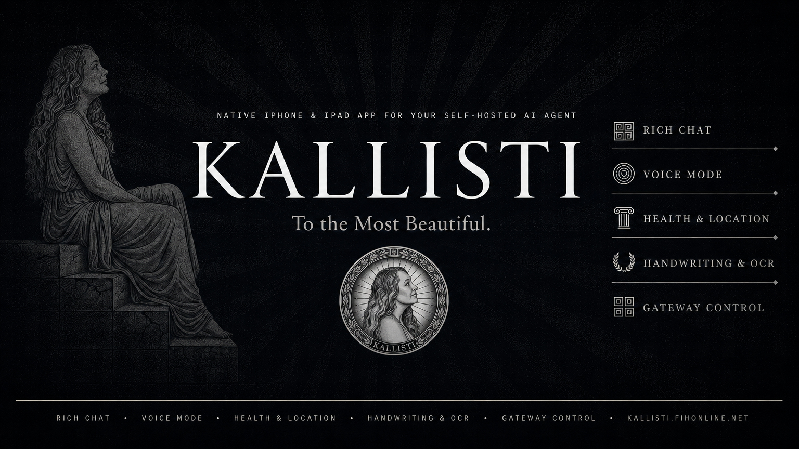

# Kallisti

<p align="center">
  
</p>

<p align="center">
  <a href="https://kallisti.fihonline.net"></a>
  
  
  
  
</p>

---

**Self-hosted AI companion for iPhone and iPad.** Connects to your [Hermes Agent](https://github.com/nousresearch/hermes-agent) runtime. Streaming chat, voice mode, health sensors, handwriting OCR, gateway control, and widgets — all on your own infrastructure.

No cloud. No subscription. No data leaving your server.

## Features

- **Rich Chat** — Streaming markdown, syntax-highlighted code, tool call bubbles, canvas mode
- **Voice Mode** — MiMo ASR/TTS with Apple TTS fallback, push-to-talk, barge-in
- **Health & Sensors** — HealthKit, CoreLocation, CoreMotion — all piped to your agent
- **Handwriting & OCR** — Apple Notes extraction, Vision OCR, PencilKit canvas
- **Gateway Control** — Restart, monitor, and manage your relay from your phone
- **Widgets & Live Activities** — Home Screen, Lock Screen, Dynamic Island
- **Push Notifications** — APNs with silent push, rich notifications, reply actions
- **Security** — Keychain, App Attest, biometric auth. Data never leaves your relay.

## Quick Start

### 1. Install the Connector

```bash
pip install kallisti-connector
kallisti-connector start --hermes-url http://your-server:8642 --key YOUR_API_KEY
```

### 2. Build the App

```bash
git clone https://github.com/fireishott/Kallisti.git
cd Kallisti
xcodegen generate
open Kallisti.xcodeproj
```

Build to your device with your Apple Developer account (Team ID: 58U7UPFS53 or your own).

### 3. Connect

Open Kallisti on your iPhone, tap **Connect**, and scan the QR code from your connector terminal.

## Architecture

```
iPhone (Kallisti) → Gateway Connector → Hermes Agent (your server)
```

All traffic flows through the connector you run. CFWD operates no backend services.

## Requirements

- iOS 18+
- Xcode 16+
- A running [Hermes Agent](https://github.com/nousresearch/hermes-agent) instance
- Apple Developer account (free or paid)

## License

MIT — see [LICENSE](LICENSE). Build it, modify it, distribute it. No gates.

## Links

- **Website:** [kallisti.fihonline.net](https://kallisti.fihonline.net)
- **Privacy:** [kallisti.fihonline.net/privacy.html](https://kallisti.fihonline.net/privacy.html)
- **Hermes Agent:** [github.com/nousresearch/hermes-agent](https://github.com/nousresearch/hermes-agent)

---

*Built by [CFWD](https://gocfwd.net) · © 2026 CFWD*
